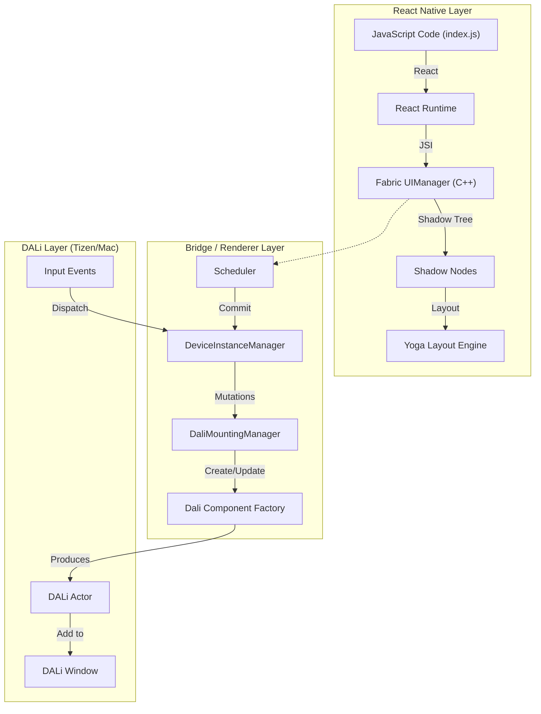

# Architecture: DALi React Native Renderer

This document outlines the architecture of the DALi React Native Renderer, designed to support the React Native New Architecture (Fabric).

## High-Level Overview

The system bridges the **React Native Fabric** C++ core with the **DALi** Scene Graph. It replaces the platform-specific UI layer (like Android Views or iOS UIViews) with DALi Actors.

### Systems Diagram



## Key Components

### 1. DeviceInstance Manager (`DeviceInstanceManager`)
*   **Role**: Acts as the central controller for the React Native instance.
*   **Responsibilities**:
    *   Initializes the JS Runtime (**JavaScriptCore** via `JSCRuntime`).
    *   Initializes the Fabric **Scheduler** and **SurfaceHandler**.
    *   Manages the lifecycle of the Surface.
    *   (Currently) Simulates JS execution for testing the rendering pipeline.

### 2. DALi Mounting Manager (`DaliMountingManager`)
*   **Role**: The "Builder" of the visual scene. It receives instructions (Mutations) from the Fabric Scheduler and executes them using DALi APIs.
*   **Responsibilities**:
    *   **ProcessMutation**: Handles `Create`, `Delete`, `Update`, `Insert`, `Remove` instructions.
    *   **Actor Registry**: Maintains a map of `tag` (React ID) to `Dali::Actor`.
    *   **Tree Management**: Handles parent-child relationships (e.g., adding a View to another View).
    *   **Root Management**: Resizes the Root View to match the Window.

### 3. DALi Components (`src/components/`)
*   **Role**: Wrappers/Adaptors that map specific React primitives to DALi Toolkit Controls.
*   **Implementation**:
    *   `DaliViewComponent` -> `Dali::Toolkit::Control`
    *   `DaliTextComponent` -> `Dali::Toolkit::TextLabel`
    *   `DaliImageComponent` -> `Dali::Toolkit::ImageView`
*   **Props Handling**: Parses the `folly::dynamic` (or raw string in prototype) props from React and applies them as DALi Properties (e.g., `BackgroundColor`, `Text`, `ImageURL`).

### 4. JS Runtime (JavaScriptCore)
*   We use the **system-provided JavaScriptCore** framework on macOS.
*   Bridged via `JSCRuntime` (sourced from React Native's `ReactCommon/jsc`).
*   This avoids the complexity of building the Hermes engine manually for this macOS prototype, while keeping the JSI interface standard.

## Data Flow (Fabric Pipeline)

1.  **Render Phase (JS)**: React executes JS, creating a React Element Tree.
2.  **Commit Phase (Fabric)**: Fabric converts this to a C++ Shadow Tree.
3.  **Layout Phase (Yoga)**: Yoga calculates layout (x, y, width, height) for all nodes.
4.  **Diffing Phase**: Fabric compares the new Shadow Tree with the old one generating a list of **Mutations**.
5.  **MountPhase (DALi)**:
    *   `DaliMountingManager` receives the mutations.
    *   **Create**: `Dali::Actor::New()` is called.
    *   **Update**: Properties (Color, Text) are applied.
    *   **Mount**: Actors are added to the Window or their parent Actors.

## Directory Structure

``` text
dali-react-native/
├── src/
│   ├── DaliRenderer.*       # Entry point
│   ├── DaliMountingManager.*# Scene Graph mutation handler
│   ├── DeviceInstanceManager.* # JS/Scheduler lifecycle
│   └── components/          # Component mappers
├── third_party_dependencies/# Native libs (Folly, Glog, etc.)
├── cmake/                   # Build config
└── README.md                # Usage guide
```
