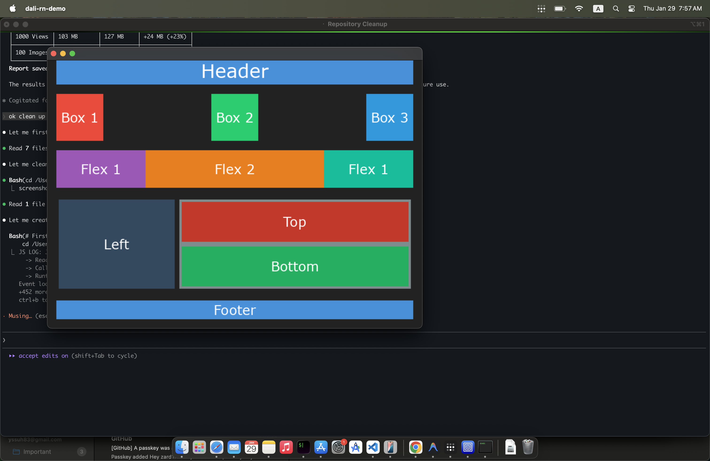

# DALi React Native Renderer (New Architecture)

This project is a Proof of Concept (PoC) renderer implementation for **React Native's New Architecture (Fabric)** on **Tizen/DALi**, running on macOS for development.

It demonstrates how to bridge React Native's C++ core (Fabric) with the DALi Scene Graph, utilizing **JavaScriptCore** as the JS runtime and mapping React components to DALi Actors.



## Features

- **React Native Fabric Integration**: Uses the C++ core of React Native (JSI, Fabric, Renderer).
- **Real JS Bundle Execution**: Loads and executes actual React Native JavaScript bundles via JavaScriptCore.
- **DALi Scene Graph Mapping**: Maps React view primitives (`<View>`, `<Text>`, `<Image>`) to DALi `Control`, `TextLabel`, and `ImageView`.
- **Text Rendering**: Extracts text content and styling (font size, color) from Fabric's ParagraphState.
- **Main-Thread Safety**: All DALi API calls are constrained to the main thread using Dali::Timer.
- **Manual Dependency Build**: Includes scripts to build necessary dependencies (`Folly`, `Glog`, `Yoga`, etc.) cleanly on macOS.

## Prerequisites

- **macOS** (Project is currently configured for macOS build environment).
- **Xcode Command Line Tools** (Clang/LLVM).
- **CMake** (3.14+).
- **Node.js & npm**.
- **DALi Environment**: You need the DALi libraries installed or available in your PKG_CONFIG_PATH. (Assumes a local Tizen/DALi env setup).

## Project Structure

- `src/`: C++ Source code for the Renderer.
    - `DaliRenderer`: Entry point, initializes the bridge and manages the main event loop.
    - `DaliMountingManager`: Handles Shadow Tree mutations and updates the DALi scene graph.
    - `DeviceInstanceManager`: Manages the JS Runtime (JSC), Fabric Scheduler, and surface lifecycle.
    - `components/`: DALi-specific component implementations (`DaliViewComponent`, `DaliTextComponent`, `DaliImageComponent`).
- `third_party_dependencies/`: Directory where manual dependencies are built.
- `node_modules/`: React Native sources.
- `cmake/`: CMake helper modules.
- `index.js`: React Native application entry point.

## Setup and Build

1. **Install npm dependencies**:
    ```bash
    npm install
    ```

2. **Build C++ Dependencies**:
    This project requires several static libraries (Folly, Glog, Yoga, etc.). Run the helper script to build them:
    ```bash
    ./build_deps.sh
    ```
    *Note: This may take some time as it compiles Folly and Boost parts.*

3. **Build the Demo Application**:
    ```bash
    mkdir build
    cd build
    cmake ..
    make -j4
    ```

## Running the Demo

After building, run the executable:

```bash
./build/dali-rn-demo
```

**Expected Output**:
A window should appear displaying:
- **"Hello from React Native!"** (Blue text, 32pt)
- **"Powered by Dali + Fabric"** (Black text, 18pt)

## Architecture

The renderer follows this flow:

1. **JavaScriptCore** loads and executes `index.js`
2. **React's Fabric** reconciles the component tree and generates mutations
3. **DaliMountingManager** processes mutations (Create, Insert, Update, Delete)
4. **DALi Actors** are created and managed in the scene graph
5. **Dali::Timer** drives the event loop on the main thread

## Current Status

- ✅ Real JS bundle execution via JavaScriptCore
- ✅ Fabric integration with mutation processing
- ✅ Text rendering with font size and color extraction
- ✅ Thread-safe DALi API usage (main thread only)
- ✅ View and Text component mapping
- ⬜ Image component (placeholder implementation)
- ⬜ Touch/gesture handling
- ⬜ Full Tizen deployment

## License

This project is for demonstration purposes.
